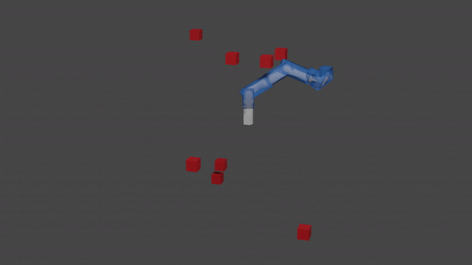
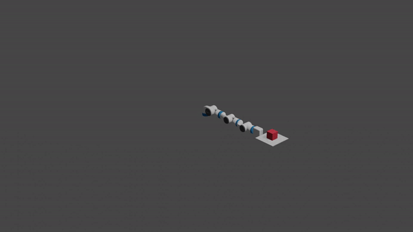

# rtd-pybullet
Running ARMTD ([Autonomous Reachability-based Manipulator Trajectory Design](https://arxiv.org/abs/2002.01591)) in various platforms and simulate in pybullet, and create rendered animation.

## Installation and Dependencies
- At the root folder, run `pip install -e .` to set up the package.
- The physics engine of the smulation is [Bullet](https://github.com/bulletphysics/bullet3). For more information, check out their [documentation](https://pybullet.org/wordpress/index.php/forum-2/).
- The rendering part of this project is using [pybullet_blender_recorder](https://github.com/huy-ha/pybullet-blender-recorder). Please check out their instructions before doing rendering.
- [Zonopy](https://github.com/kwonyos/zonopy) is a new python package to calculate rechable sets and render simulations. It is cloned as a submodule in this repo. This is where the Kinova obstacle avoidance task is generated from.

## Examples
### Kinova obstacle avoidance using ARMTD

    

### Fetch carrying objects using ARMTD with force closure

    

## Runnint zonopy + pybullet
Go to `scripts/` and run `test_bullet_zonopy.py` to see what happens.

## Rendering trajectory and zonotopes
### I. Running zonopy simulation and record data
Zonopy environment will generate an obstacle avoidance task, where a Kinova arm starts from a random position moves towards a random goal positions, with random obstacles around. Run `scripts/test_zonopy.py` to see what happens.

### II. Save the reachable sets as mesh files
In order to visualize the reachable sets in Pybullet and in Blender, it has to be saved as mesh files so that they can be imported. Use MATLAB to run `zonotope/FO2stl_zonopy.m` will save those reachable sets as convex set in the format `.stl`. Don't forget to change folder.

### III. Convert mesh files to urdf
Since the *pybullet_blender_recorder* works the best with `.urdf` format, we can convert those files to `.urdf` first. This process is done using [pymeshlab](https://pymeshlab.readthedocs.io/en/latest/) and [object2urdf](https://github.com/harvard-microrobotics/object2urdf). These packages make things easy. Running `utils/stl2obj2urdf.py` will do the job.

### IV. Running the pre-computed trajectories in Pybullet
The pre-computed trajectories are discrete time and are assumed to be perfect tracking. We can track the trajectories using Pybullet with much smaller time step and real physics. The Pybullet environment is set up in [here](https://github.com/Wangbaiyue007/rtd-pybullet/blob/master/bullet/bulletRtdEnv.py). Run `scripts/bullet_zonopy_obstacle_avoidance.py` to see the Pybullet simulation. In the mean time, the motions of the arm and the reachable sets are saved as `.pkl` files.

### V. Render animation using Blender
With all the `.pkl` files, it is easy to do the rendering by importing them to Blender. Check out the instructions [here](https://github.com/huy-ha/pybullet-blender-recorder).

